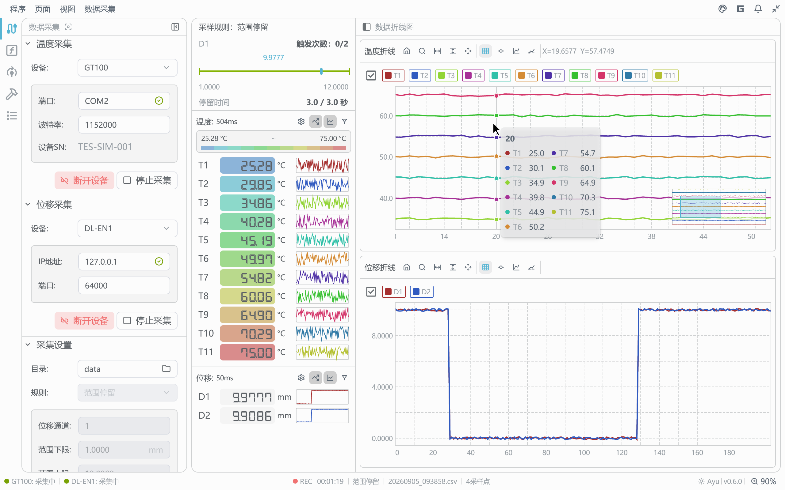

# Hi, I'm Hills 👋

**算法工程师 · Algorithm Engineer**  
GSK 广州数控设备有限公司 · Guangzhou, China

用算法理解工业数据，用 Rust 构建可靠而高效的桌面工具。

## 关于我

- 🧠 专注于 **算法工程**，探索 CNC、工业测量与智能制造中的算法应用。
- 🦀 热衷于 **Rust**，关注性能、可靠性，以及从设备通信到桌面交互的软件工程实践。
- 🛠️ 正在构建 **TES**，将温度与位移采集、数据分析和热误差建模串成完整的实验流程。
- ✨ 喜欢 **Zed**，也关注 GPUI、现代开发工具与桌面应用体验。

## 项目与实践

### [TES · 温度与位移测量工作台](https://github.com/GOODDASH/tes-website)

面向热误差实验的桌面工作台，让设备采集、数据处理、图表探索与误差建模在同一个工作区衔接。

`Rust` · `GPUI` · `gpui-component`

- **设备采集**：接入温度与位移设备，支持定时、范围停留与 IO 触发记录。
- **分析与建模**：结合公式处理、交互式图表、聚类和回归，探索数据与误差模型。
- **流程自动化**：通过 `tesctl` 控制已运行的 TES，将采集、分析和建模接入脚本流程。

<a href="https://github.com/GOODDASH/tes-website">
  <picture>
    <source media="(prefers-color-scheme: dark)" srcset="./assets/tes-collect-dark.png">
    <source media="(prefers-color-scheme: light)" srcset="./assets/tes-collect-light.png">
    
  </picture>
</a>

公开仓库展示 TES 的产品介绍与界面，不包含桌面应用源码。

## 技术兴趣

| 方向 | 关注点 |
| :--- | :--- |
| 算法与工业数据 | 数据分析、热误差建模、算法在实际测量中的应用 |
| Rust 工程实践 | 高性能、可靠性、设备通信与并发处理 |
| 桌面应用 | GPUI、数据可视化与交互体验 |
| 开发工具 | Zed、CLI、可复用的实验工作流 |

---

  Building precise tools for real-world engineering.

